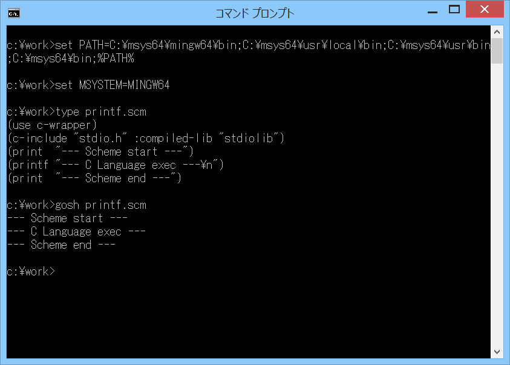

# c-wrapper-mg



## 概要
- Gauche 用 の c-wrapper を MinGW (32bit) 上で動くように改造したものです。  
  c-wrapperは、GacuheからC言語のライブラリを呼び出せるようにするモジュールです。  
  正直中身は難しくてあまり理解できていませんが、  
  どうにかテストは(stdioのsys-fork以外は)通るようになりました。

- オリジナルの情報は、以下にあります。  
  http://www.koguro.net/prog/c-wrapper/index-j.html  
  ただし、ソースコードは、  
  http://hg.koguro.net/c-wrapper  
  で最新と思われる c-wrapper v0.6.1 (ChangeLog 2012-07-19) をダウンロードしてベースとしました。

- もともと付属していたlibffiは削除して、  
  https://sourceware.org/libffi/  
  にある libffi-3.2.1 を使うようにしました。  
  (libffi-3.2.1は同梱していないため別途入手が必要です。  
  そして、元のlibffiと同様に一部修正を行う必要があります)  
  (libffiのバージョンが上がって上記のページに存在しない場合は、  
   ftp://sourceware.org/pub/libffi/ から旧バージョンを取得可能です)

- またMinGWに存在しないmmap関数については、  
  https://code.google.com/p/mman-win32/  
  にある mman.h と mman.c をソースに取り込みました。  
  (1箇所MinGWとバッティングする関数名(mprotect)はリネームしました)


## 変更点
- MinGW用にオリジナルから変更した内容を以下に示します。

1. configure.ac の変更  
   `*-mingw*` という場合分けのセクションを追加。

2. Gaucheのインストール先パスの空白対応  
   configure.ac や Makefile.in の該当箇所をダブルクォートでくくることで対応。  
   (Gaucheのインストール先パスについてのみ対応)

3. libffiの変更  
   元のlibffiは削除して、  
   https://sourceware.org/libffi/  
   からlibffi-3.2.1を別途入手。  
   不具合があるので src/x86 フォルダ内の ffi.c を以下のように修正した。
   ```
   (1)ffi.c の ffi_prep_cif_machdep 関数で、戻り値のスタック確保の条件を変更
        X86_WIN32 のときに is_result_on_stack 関数で戻り値がスタックを使うかどうか
        判定するようにした。
        is_result_on_stack関数は、元のlibffiの src/prep_cif.c からコピーした。
        この判定がないと Segmentation Fault エラーで落ちるので必須と思われる。

   (2)ffi.c の ffi_prep_cif_machdep 関数で、スタック確保のサイズにスペースを追加
        X86_WIN32 のときに 以下のようにスペースを追加するようにした。
          cif->bytes = ((cif->bytes + 15) & ~0xF) + 8;
        これは元のlibffiの src/prep_cif.c の ffi_prep_cif関数で追加していたため
        同じようにした。ただし、これが必須なのかどうかはよく分からない。
   ```
   上記修正後、libffi-3.2.1 の ./configure → make を実行し、  
   生成された i686-pc-mingw32 フォルダ内の .lib フォルダと include フォルダを、  
   c-wrapper の src/libffi フォルダの下にコピーした。

4. dlopenの対応  
   dlopen, dlsym, dlerror等の関数が、MinGWには存在しない。  
   ただし c-wrapper は、すでにCygwin対応でWin32 APIに切り換え可能になっていたので、  
   ほぼそのまま利用できた。  
   1箇所、c-ffi.c で EnumProcessModules で取得したモジュールハンドルを、  
   CloseHandleしているが、これがあると gdb で unknown signal と出てデバッグができなかった。  
   CloseHandleしてはいけないようなのでコメントアウトしたところ、gdbでデバッグできるようになった。  
   また、インクルードでエラーになったので、  
   `__MINGW32__` が定義済みのときは c-ffi.h で dlfcn.h を インクルードしないようにした。

5. mmapの対応  
   mmap関数が、MinGWには存在しない。  
   https://code.google.com/p/mman-win32/  
   から mman.h と mman.c を入手。  
   c-wrapper の src フォルダにコピーして取り込むようにした。  
   そして、`__MINGW32__` が定義済みのときは closure_alloc.h で src フォルダの下の mman.h を  
   インクルードするようにした。  
   あと、1箇所MinGWとバッティングする関数名(mprotect)をリネームした(mman.hとmman.cを変更)。  
   また、configure.ac に FFI_SRC_ADD という定義を追加した。

6. cwcompile で c-load-library の処理に失敗する
   ```
   stubgen.scm
     compile-wrapper
       c-load-library
         変数名libsがバッティングしていたのを修正
         また、regexp-replaceの引数不足を修正
         しかしまだ直らない?
         ライブラリ名の取得に失敗している?
         以下のようにオプションをちゃんと指定したらいけた。
           (c-load-library "./ffitest2" :option "-L.")
           (c-include "./ffitest2.h" :compiled-lib "ffitelib2")
       c-include
         キーワードhideの定義もれ修正
   ```

7. テストの test_bitfield2 でSegmentation Faultエラー
   ```
   c-ffi.scm
     init-decl-alist!
       構造体にビットフィールドの先頭があらわれたら、シフト値を0にするように変更した。
       本当にこれでよいのかは、よく分からない。
   ```

8. config.scm.in に MinGW 用の場合分けを追加
   ```
     lib/c-wrapper/config.scm.in に (when @MINGW_FLAG@ という場合分けを追加した。
     configure.ac に MINGW_FLAG の定義を追加した。
   ```

9. cwcompileの先頭行の変更(空白のパスが入るので対策)
   ```
     src/cwcompile.in の先頭行の記述を変更。
     configure.ac に CWCOMPILE_SHEBANG の定義を追加した。
   ```


## インストール方法
- インストールの方法を以下に示します。

1. Gaucheのインストール  
   事前に Gauche がインストールされている必要があります。  
   以下のページに Windows用バイナリインストーラ があるので インストールを実施ください。  
   http://practical-scheme.net/gauche/download-j.html

2. MinGWのインストール  
   事前に MinGW がインストールされている必要があります。  
   以下のページを参考にインストールを実施ください。  
   https://gist.github.com/Hamayama/362f2eb14ae26d971ca4

3. c-wrapperのソースの展開  
   本サイト( https://github.com/Hamayama/c-wrapper-mg )のソースを、  
   (Download Zipボタン等で)ダウンロードして、作業用のフォルダに展開してください。  
   例えば、作業用のフォルダを c:\work とすると、  
   c:\work\c-wrapper の下にファイルとフォルダ一式が配置されるように展開してください。
   ```
   (注意) フォルダのパスに空白があるとコンパイルに失敗するので、
          空白を入れないようにしてください。
   ```

4. libffi-3.2.1のダウンロード  
   https://sourceware.org/libffi/  
   から libffi-3.2.1.tar.gz をダウンロードして展開します。  
   (libffiのバージョンが上がって上記のページに存在しない場合は、  
    ftp://sourceware.org/pub/libffi/ から旧バージョンを取得可能です)  
   例えば作業用のフォルダを c:\work とすると、このフォルダにファイルを置いて、  
   コマンドプロンプトを開いて以下を実行すると展開されます。
   ```
     bash
     cd /c/work
     tar zxvf libffi-3.2.1.tar.gz
   ```

5. libffi-3.2.1のファイルの修正  
   c-wrapper  の libffi_patch フォルダにある ffi.c を、  
   libffi-3.2.1 の src/x86 フォルダ内の ffi.c に上書きコピーしてください。

6. libffi-3.2.1のコンパイル  
   コマンドプロンプトを開いて以下を実行します。
   ```
     bash
     cd /c/work/libffi-3.2.1
     ./configure    # Makefile等を生成します
     make           # コンパイルを実行します
   ```

7. 生成したライブラリとヘッダをc-wrapperのフォルダにコピー  
   コンパイルが完了すると libffi-3.2.1 の下に i686-pc-mingw32 というフォルダができます。  
   この中の .libs フォルダと include フォルダ を、  
   c-wrapper の src/libffi フォルダの下にコピーしてください。
   ```
     c-wrapper
         |-- src
              |-- libffi
                     |-- .lib
                     |-- include
   ```

8. c-wrapperのコンパイル  
   コマンドプロンプトを開いて以下を実行します。  
   ```
     bash
     cd /c/work/c-wrapper
     ./DIST gen     # configureファイルを生成します
     ./configure    # Makefile等を生成します
     make           # コンパイルを実行します
   ```

9. c-wrapperのインストール  
   コマンドプロンプトを開いて以下を実行します。
   ```
     bash
     cd /c/work/c-wrapper
     make install
   ```
   Gaucheのライブラリフォルダに生成したファイルがコピーされます。  
   (注意) 環境によっては make install を実行すると、  
   「*** ERROR: mkstemp failed」というエラーが発生します。  
   このエラーは c:\Program Files (x86) のフォルダに 書き込み権限がないとき等に発生します。  
   その場合は、コマンドプロンプトを開くときに、  
   コマンドプロンプトのアイコンを右クリックして、「管理者として実行」を選択してください。  
   そして再度上記のコマンドを実行してください。

10. c-wrapperのテスト  
    コマンドプロンプトを開いて以下を実行します。
    ```
     bash
     cd /c/work/c-wrapper
     make check
    ```
    テスト結果はc-wrapperのtestsuiteフォルダ内のtest.logに記録されます。

- 以上です。


##使い方
- MinGW用の実行サンプルをいくつかexamples_mingwフォルダに格納しました。  
  (benchmark, examples, experimentフォルダのサンプルは動作未確認です)

1. SDL2サンプル  
   https://github.com/Hamayama/c-wrapper-mg/tree/master/examples_mingw/sdl2

2. MML音楽演奏サンプル  
   https://github.com/Hamayama/c-wrapper-mg/tree/master/examples_mingw/mml

3. TTF表示サンプル  
   https://github.com/Hamayama/c-wrapper-mg/tree/master/examples_mingw/ttf


## その他 問題点等
1. テストの stdio-test.scm で fork failed エラー  
   → Windows に sys-fork がないので仕方ない  
   → Windows のときは sys-fork-and-exec を使うようにテストの方を変更した

2. ヘッダファイル(.h)だけを変更した場合にmakeで再コンパイルされない  
   → make clean してから make すればコンパイルできる  
      (ヘッダファイルだけを変更することはまずないと思うが、はまったので一応メモ)

3. テストの ffitest.h, ffitest.c でマクロの部分がgdbでデバッグ(ステップ実行)しにくい  
   → いくつかマクロを展開したものを、べたに書いてデバッグした

4. c-wapperを利用したscmファイルを、gosh-noconsole.exe で実行すると動作しない(途中で止まる)  
   (GaucheのWindows用インストーラは、デフォルトでscmファイルを  
    gosh-noconsole.exe に関連付けするので、scmファイルをダブルクリックで実行すると  
    この現象が出る)  
   → よく分かっていないが、c-wrapperの仕組み上コンソールが必要なもよう  
   → 基本的には gosh.exe で実行する必要がある  
      (例えばバッチファイルを作成して gosh xxx.scm を実行する等)  
   → 回避策として c-include や c-load を実行する前に  
      (display #\cr)(flush) や (print "XXX") を実行してコンソールを割り当てるようにすれば、  
      gosh-noconsole.exe でも動かすことができた。  
      ただし、コマンドプロンプトの画面が出る。  
      どうしてもコマンドプロンプトの画面を出したくない場合には、以下のページを参照のこと。  
      https://github.com/Hamayama/msconalloc


## その他 ノウハウ等
1. デバッグ用のコンパイル  
   以下のように Makefile を書き換えると、gdbでデバッグしやすくなります。  
   (コンパイルオプションに -g をつける。また必要に応じて最適化オプションを外す)
   ```
     c-wrapper
       srcフォルダ内のMakefile
         CPPFLAGS       = -I./libffi/include -DGAUCHE_API_0_8_8 
           ↓
         CPPFLAGS       = -g -I./libffi/include -DGAUCHE_API_0_8_8 

       testsuiteフォルダ内のMakefile
         CFLAGS         = -c -o
           ↓
         CFLAGS         = -g -c -o

     libffi-3.2.1
       i686-pc-mingw32フォルダ内のMakefile
         CFLAGS = -O3 -fomit-frame-pointer -fstrict-aliasing -ffast-math -march=core2  -Wall -fexceptions
           ↓
         CFLAGS = -g -O3 -fomit-frame-pointer -fstrict-aliasing -ffast-math -march=core2  -Wall -fexceptions
   ```
   変更したら make clean してから再度 make が必要です。  
   (./configureを実行するとMakefileが元に戻ってしまうので注意してください)

2. デバッグのしかた  
   Segmentation Fault 等のエラーが発生した場合は、gdbを使ってデバッグを行います。  
   例えば、c:\work フォルダにある test.scm を実行してエラーとなった場合は、  
   コマンドプロンプトを開いて以下を実行します。
   ```
     bash
     cd /c/work
     gdb --args gosh test.scm
   ```
   以後はgdbの各コマンドを使ってデバッグを行います。
   ```
     r                      実行
     info stack (またはbt)  スタックトレースの表示
                            (エラー発生時に実行すると、スタックフレームにある
                             C言語の関数の呼び出し履歴が表示されます。
                             前述のMakefileの設定を行っていれば、
                             行番号も表示されます。
                             かなり有力なデバッグの手がかりになります)
     b 関数名               ブレークポインタの設定
     b ファイル名:行番号    ブレークポインタの設定
     p 変数名               変数の内容の表示
     s                      ステップ実行(関数の中まで追いかけるとき)
     n                      ステップ実行(関数の中までは追いかけないとき)
     c                      実行再開
     q                      終了
   ```
   他にもいろいろなコマンドがあります。gdbのコマンドの詳細については、  
   gdbの使い方を説明したネット上のページ等を参照ください。


## 環境等
- OS
  - Windows XP Home SP3
  - Windows 8 (64bit)
- 環境
  - MinGW (32bit) v4.8.1
- 言語
  - Gauche v0.9.4
- ライセンス
  - オリジナルと同様とします(COPYINGファイル参照)

## 履歴
- 2014-9-6   v0.6.1-mg0001 MinGW対応
- 2014-9-8   v0.6.1-mg0002 configure.ac, config.scm.in, cwcompile.in を変更  
  (configure.ac を変更したため ./DIST gen → ./configure  → make install が必要)
- 2014-9-8   v0.6.1-mg0003 config.scm.in の変更ミス修正  
  ( ./configure → make install が必要)
- 2014-10-16 v0.6.1-mg0004 SDL2サンプル examples/sdl2 を追加
- 2014-10-17 v0.6.1-mg0005 MinGW用のサンプルは examples_mingw フォルダに移動  
  c-ffi.cのlookup_symbol関数にデバッグ用コード追加(今はコメントアウトしてある)
- 2014-11-1  v0.6.1-mg0006 MML音楽演奏サンプル examples_mingw/mml を追加
- 2014-11-20 v0.6.1-mg0007 configure.ac を変更  
  ( MinGW時のCWCOMPILE_SHEBANGの定義を「/usr/bin/env gosh」にした )  
  (configure.ac を変更したため ./DIST gen → ./configure  → make install が必要)
- 2014-11-20 v0.6.1-mg0008 libffi-3.1 を libffi-3.2.1 に更新
- 2014-11-24 v0.6.1-mg0009 TTF表示サンプル examples_mingw/ttf を追加


(2015-2-14)
