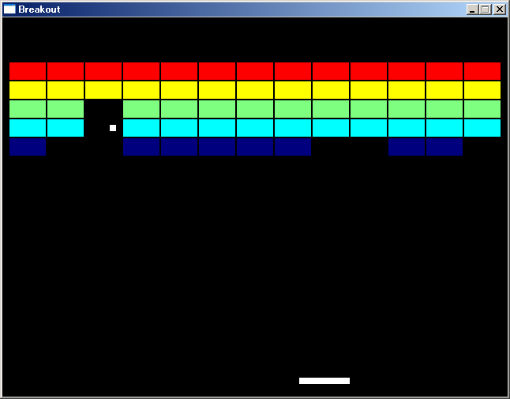

# SDL2サンプル

## 概要
- c-wrapper の SDL サンプルのブロック崩しを、SDL2 + MinGW 用に改造したものです。

## 環境のインストール方法
- Gauche, MinGW, c-wrapper, SDL2, SDL2_mixer が適切にインストールされている必要があります。

- Gauche, MinGW, c-wrapper については、  
  以下のページの「インストール方法」を参考にインストールを実施ください。  
  https://github.com/Hamayama/c-wrapper-mg

- SDL2, SDL2_mixer については、  
  以下のページを参考にインストールを実施ください。  
  https://gist.github.com/Hamayama/155b5557db31334ce492

## 実行方法
- ＜MinGW (32bit) 環境の場合＞  
  breakout-mg.bat をダブルクリック等で起動します。  
  ＜MSYS2/MinGW-w64 (64bit) 環境の場合＞  
  breakout-mg-mingw64_64.bat をダブルクリック等で起動します。  
  ＜MSYS2/MinGW-w64 (32bit) 環境の場合＞  
  breakout-mg-mingw64_32.bat をダブルクリック等で起動します。  
  
  スペースキーでボールを発射します。  
  カーソルキーの左右でパドルを動かします。  
  すべてのブロックを消すか、ボールを3個うしろにそらすと、  
  ゲームオーバーになり最初に戻ります。  
  [ESC]キーで終了します。

## 環境等
- OS
  - Windows 10 (version 1909) (64bit)
  - Windows 8.1 (64bit)
  - Windows XP Home SP3
- 環境
  - MSYS2/MinGW-w64 (64bit/32bit) (gcc version 10.2.0 (Rev5, Built by MSYS2 project)) (Windows 10)
  - MSYS2/MinGW-w64 (64bit/32bit) (gcc version 9.2.0 (Rev2, Built by MSYS2 project)) (Windows 8.1)
  - MinGW (32bit) (gcc version 6.3.0 (MinGW.org GCC-6.3.0-1))
- 言語
  - Gauche v0.9.10_rc1
  - Gauche v0.9.9
  - Gauche v0.9.8
  - Gauche v0.9.7
  - Gauche v0.9.6
  - Gauche v0.9.5
  - Gauche v0.9.4
- ライセンス
  - オリジナルと同様とします
- 効果音
  - TAM Music Factory 様 ( http://www.tam-music.com/ ) の素材を使用しています

## 履歴
- 2014-10-16 v1.00 初版
- 2014-10-17 v1.01 一部パラメータ調整
- 2014-11-24 v1.02 キー入力の定数使用
- 2014-11-28 v1.03 gosh-noconsoleでも動くようにコンソールの割り当てを追加
- 2015-11-21 v1.04 パドルのヒット位置によって反射角を変える
- 2015-11-21 v1.05 当たり判定修正等
- 2015-11-24 v1.06 コメント修正のみ
- 2016-1-6   v1.07 MSYS2/MinGW-w64 (64bit) 環境に暫定対応(実験中)
- 2016-1-10  v1.08 MSYS2/MinGW-w64 (32bit) 環境に暫定対応(実験中)
- 2016-10-14 v1.09 README修正等(Gauche v0.9.5 で動作確認)
- 2018-2-4   v1.10 SDL2 v2.0.7, SDL2_mixer v2.0.2 の音声不具合対策
- 2018-2-4   v1.11 cond-expand追加
- 2018-7-9   v1.11 README修正のみ(Gauche v0.9.6 で動作確認)
- 2019-12-20 v1.11 README修正のみ(Gauche v0.9.9 で動作確認)
- 2020-11-10 v1.11 README修正のみ(Gauche v0.9.10_rc1 で動作確認)

(2020-11-10)
