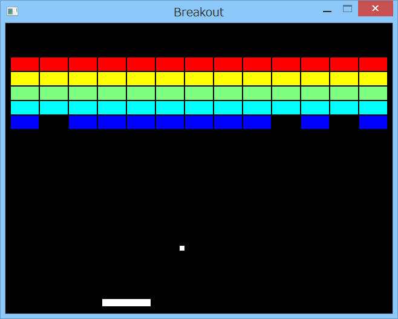

# SDL2サンプル

## 概要
- c-wrapperのSDLサンプルのブロック崩しを、SDL2 + MinGW(32bit)用に改造したものです。

## 環境のインストール方法
- Gauche, MinGW(32bit), c-wrapper, SDL2, SDL2_mixerが適切にインストールされている必要があります。

- Gauche, MinGW(32bit), c-wrapperについては、  
  以下のページの「インストール方法」を参考にインストールを実施ください。  
  https://github.com/Hamayama/c-wrapper-mg

- SDL2, SDL2_mixerについては、  
  以下のページを参考にインストールを実施ください。  
  https://gist.github.com/Hamayama/155b5557db31334ce492

## 実行方法
- breakout.bat をダブルクリック等で起動します。  
  (breakout.bat, breakout.scm, cursor5.wav, cursor6.wav が同一フォルダに存在する必要があります)  
  スペースキーでボールを発射します。  
  カーソルキーの左右でパドルを動かします。  
  すべてのブロックを消すか、ボールを3個うしろにそらすと、  
  ゲームオーバーになり最初に戻ります。  
  [ESC]キーで終了します。

## 環境等
- 以下の環境で動作を確認しました。
  - OS
    - Windows XP Home SP3
    - Windows 8 (64bit)
  - 環境
    - MinGW (32bit) v4.8.1
  - 言語
    - Gauche v0.9.4

## 履歴
- 2014-10-16 v1.00 初版
- 2014-10-17 v1.01 一部パラメータ調整
- 2014-11-24 v1.02 キー入力の定数使用

(2014-11-26)
